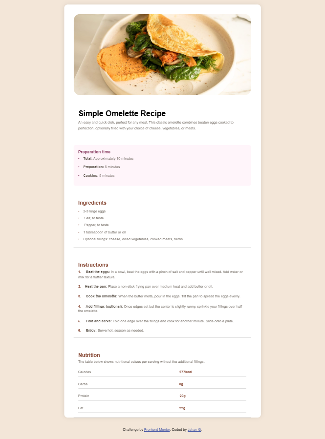

# Frontend Mentor - Recipe page solution

This is a solution to the [Recipe page challenge on Frontend Mentor](https://www.frontendmentor.io/challenges/recipe-page-KiTsR8QQKm). Frontend Mentor challenges help you improve your HTML, CSS, and responsive design skills by building realistic projects.

## Table of contents

- [Overview](#overview)
  - [Screenshot](#screenshot)
  - [Links](#links)
- [My process](#my-process)
  - [Built with](#built-with)
  - [What I learned](#what-i-learned)
  - [Continued development](#continued-development)
  - [Useful resources](#useful-resources)
- [Author](#author)

## Overview

### Screenshot



### Links

- Solution URL: [GitHub Repository](https://github.com/Jahan221801/Frontend-recipe-page)
- Live Site URL: [Live Demo](https://jahan221801.github.io/Frontend-recipe-page/)

## My process

### Built with

- Semantic HTML5 markup
- CSS custom properties
- Flexbox
- Responsive Media Queries
- Mobile-first workflow

### What I learned

While building this page, I improved my understanding of:

- Using **semantic HTML** for better accessibility and structure
- Creating a responsive layout using **media queries**
- Styling sections and components with **CSS custom properties** for cleaner code
- Building visually appealing designs without relying on external frameworks

Here’s a sample snippet I liked using:

```css
.main1 {
  max-width: 700px;
  margin: 0 auto;
  background-color: white; 
  border-radius: 12px;
  overflow: hidden;
  box-shadow: 0 0 20px rgba(0, 0, 0, 0.1);
}
